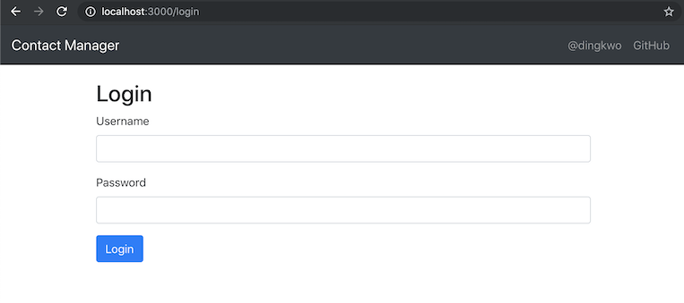

## Prerequisites

### Installed on your machine
- Maven 3.3.9+
- JDK version 1.8.0_51+
- Docker Desktop 2.0.0.3+
- Chrome 74+
- IntelliJ (preferred) or other IDE with the JDK configured

## Verification of setup

1. Clone the following project.
```
git clone https://github.com/kwoding/contact-frontend-test.git
```

2. Verify you can run the test application by executing the following command:

Inside the `src/test/resources` folder, run:
```
docker-compose -f docker-compose-wiremock.yml up
```

3. The logs (of Docker) should end as follows:
```
contact-frontend_1  | You can now view contact-frontend in the browser.
contact-frontend_1  | 
contact-frontend_1  |   Local:            http://localhost:3000/
contact-frontend_1  |   On Your Network:  http://172.21.0.3:3000/
contact-frontend_1  | 
```

4. Navigate in your Chrome browser to http://localhost:3000, you should see the following on your screen.



5. Run the following command in the root folder of the project (in a different terminal window) to ensure you have everything set up.

```
mvn clean test
```

Expected result is a successful build:
```
-------------------------------------------------------
 T E S T S
-------------------------------------------------------
Running it.ding.contact.BaseTest
SLF4J: Failed to load class "org.slf4j.impl.StaticLoggerBinder".
SLF4J: Defaulting to no-operation (NOP) logger implementation
SLF4J: See http://www.slf4j.org/codes.html#StaticLoggerBinder for further details.
Starting ChromeDriver 74.0.3729.6 (255758eccf3d244491b8a1317aa76e1ce10d57e9-refs/branch-heads/3729@{#29}) on port 47660
Only local connections are allowed.
Please protect ports used by ChromeDriver and related test frameworks to prevent access by malicious code.
Apr 29, 2019 8:14:43 PM org.openqa.selenium.remote.ProtocolHandshake createSession
INFO: Detected dialect: OSS
Request method: POST
Request URI:    http://localhost:8080/__admin/reset?_csrf
Proxy:                  <none>
Request params: <none>
Query params:   _csrf
Form params:    <none>
Path params:    <none>
Headers:                Accept=*/*
                                Content-Type=application/json; charset=UTF-8
Cookies:                <none>
Multiparts:             <none>
Body:                   <none>
HTTP/1.1 200 OK
Transfer-Encoding: chunked
Server: Jetty(9.2.z-SNAPSHOT)
Request method: POST
Request URI:    http://localhost:8080/__admin/mappings?_csrf
Proxy:                  <none>
Request params: <none>
Query params:   _csrf
Form params:    <none>
Path params:    <none>
Headers:                Accept=*/*
                                Content-Type=application/json; charset=UTF-8
Cookies:                <none>
Multiparts:             <none>
Body:
/Users/kwoding/workspace/projects/private/contact/contact-frontend-test/target/test-classes/login.json
HTTP/1.1 201 Created
Content-Type: application/json
Transfer-Encoding: chunked
Server: Jetty(9.2.z-SNAPSHOT)

{
    "id": "a9314892-eb7f-4dea-b4c5-8592f8fd18ee",
    "request": {
        "urlPathPattern": "/login",
        "method": "POST"
    },
    "response": {
        "status": 200,
        "headers": {
            "Content-Type": "application/json"
        }
    },
    "uuid": "a9314892-eb7f-4dea-b4c5-8592f8fd18ee"
}
Request method: POST
Request URI:    http://localhost:8080/__admin/mappings?_csrf
Proxy:                  <none>
Request params: <none>
Query params:   _csrf
Form params:    <none>
Path params:    <none>
Headers:                Accept=*/*
                                Content-Type=application/json; charset=UTF-8
Cookies:                <none>
Multiparts:             <none>
Body:
/Users/kwoding/workspace/projects/private/contact/contact-frontend-test/target/test-classes/logout.json
HTTP/1.1 201 Created
Content-Type: application/json
Transfer-Encoding: chunked
Server: Jetty(9.2.z-SNAPSHOT)

{
    "id": "6ba5b056-6934-461b-bf68-e74cf02675a8",
    "request": {
        "urlPathPattern": "/logout",
        "method": "POST"
    },
    "response": {
        "status": 200,
        "headers": {
            "Content-Type": "application/json"
        }
    },
    "uuid": "6ba5b056-6934-461b-bf68-e74cf02675a8"
}
Tests run: 1, Failures: 0, Errors: 0, Skipped: 0, Time elapsed: 21.18 sec

Results :

Tests run: 1, Failures: 0, Errors: 0, Skipped: 0

[INFO] ------------------------------------------------------------------------
[INFO] BUILD SUCCESS
[INFO] ------------------------------------------------------------------------
[INFO] Total time: 25.478 s
[INFO] Finished at: 2019-04-29T20:14:45+02:00
[INFO] Final Memory: 23M/234M
[INFO] ------------------------------------------------------------------------
```
